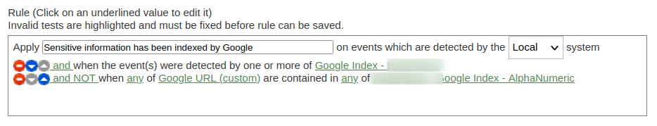
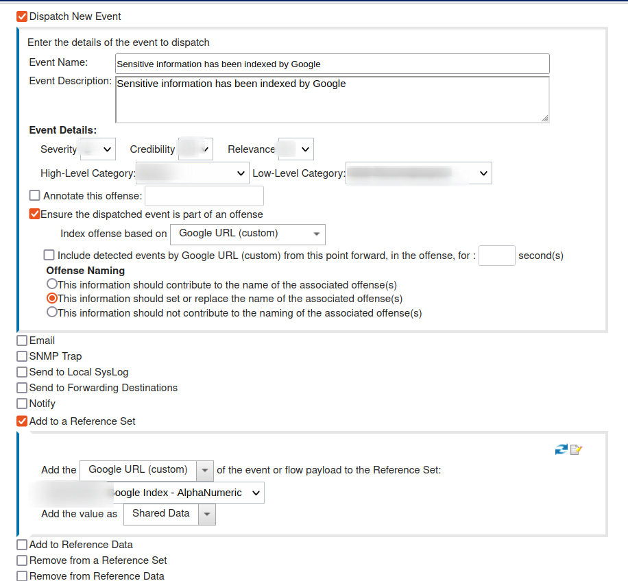
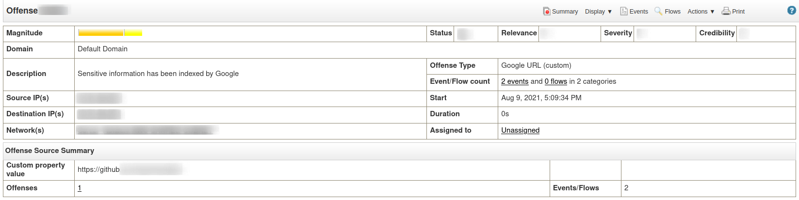

### SIEM - Use Case
For this branch, I've done tiny adjustments in order to fit with different SIEM solutions such as Azure Sentinel, QRadar and Splunk. 

Consequently, instead of maintaining the findings over a text file, we can create an offense rule that will check if the captured URI is not inside a whitelist, otherwise, an offense will be triggered, followed by an action that will be responsible to include the gathered content in the same whitelist, and therefore avoiding duplicates. 

Such configuration settings allow us to track our findings through our SIEM directly. The following images can represent the above logic upon using QRadar:

**Rule**
 
 
 

**Finding**
 
 

